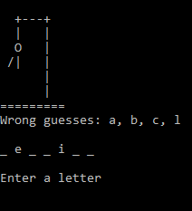

# Hangman

## Overview

Hangman is a classic game where the goal is to guess all of
the letters of a randomly generated word, each letter
represented by a blank space "\_". For each incorrect guess,
one element of a hanged stick figure is drawn. The game is
lost if all elements of the stick figure are drawn before
the word is guessed.

## Features

- Coded in Python
- ASCII art used for the 'stages' of the hanged man and logo
- Users reminded of incorrect guesses prior to next guess
- Uses Python module Random-Word to randomly generate a word
  from the dictionary

## Running the project

Clone or download and navigate to the installation
directory. If running from a terminal, type "python
main.py". Otherwise, run in your preferred IDE by clicking
the run button.

# Dependencies

- pip
- Random-Word ("pip install Random-Word")

# Screenshots

Wrong guesses:  

Ending screen:  
